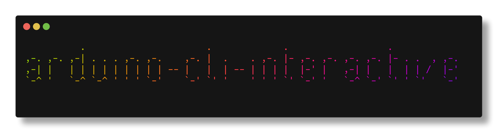
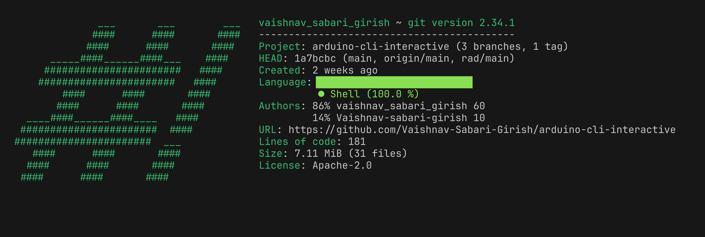
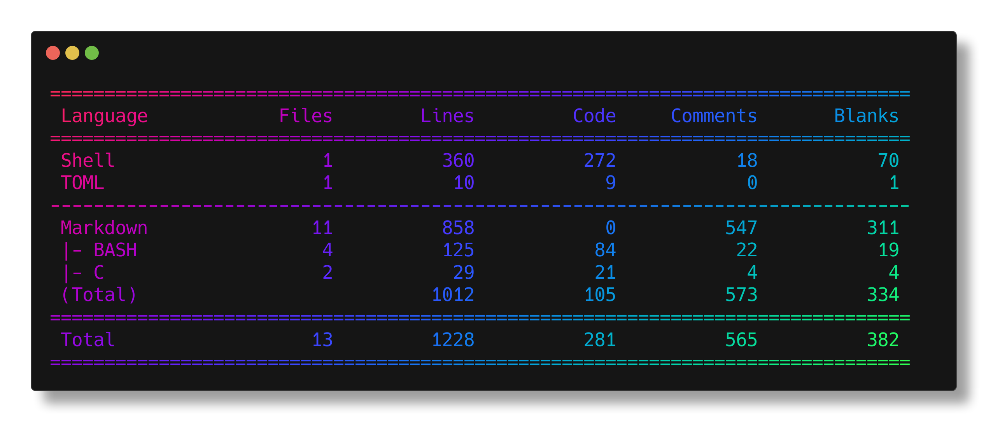

<br><br>

[](https://github.com/Vaishnav-Sabari-Girish/arduino-cli-interactive/releases/tag/v1.0.6)

`


# Arduino Interactive CLI

This tool is made specifically for those who want to transition from the Arduino IDE to the CLI , but are still scared or intimidated by the command line. 

## Before Installation. 

Before installing the tool, make sure you create a GitHub PAT (Personal Access Token), so that you can be notified when
the tool gets a new version. 

You can create a PAT token [here](https://github.com/settings/tokens). Make sure you choose Tokns (Classic), and give repo
permissions for your token. 

Once you have your PAT, copy it and save it as an Environment variables in your ~/.bashrc or ~/.zshrc file as follows :

```bash
export ACI_GITHUB_TOKEN="<your PAT>"
```

Then source your file and then install `aci`

## Installation

#### Via Homebrew 

```bash
brew install vaishnav-sabari-girish/arduino-cli-interactive/aci
```

#### From source 

```bash
git clone https://github.com/Vaishnav-Sabari-Girish/arduino-cli-interactive.git
cd bash_shell_script
chmod +x main.sh 
./main.sh 
```

Then open your `~/.bashrc` or `~/.zshrc` file and add this alias 
```bash
alias aci="<path to the cloned repository>"
```

Then in the terminal type 
```bash
source ~/.bashrc #For bash users 
source ~/.zshrc  #For zsh users
```

### Pre-requisites

#### 1. `arduino-cli` 

There are many ways to install arduino-cli. I recommend Homebrew , because all the other prerequisite tools are also available on homebrew. 

##### Homebrew 

In case you do not have Homebrew installed in your system 

##### macOS/Linux

`/bin/bash -c "$(curl -fsSL https://raw.githubusercontent.com/Homebrew/install/HEAD/install.sh)"`

##### For windows users

Use Windows Subsystem for Linux (WSL) and follow the instructions for Linux.

To learn to use WSL , the best video is by [NetworkChuck](https://youtu.be/vxTW22y8zV8?si=mZ5w9KmT0A4_d7Zr)

<br>

After installing Homebrew , go to your terminal and just type this 

```bash
brew update
brew install arduino-cli
```
##### Installing `arduino-cli` using the installation script

If you do not want to use homebrew , you can copy and paste this installation script 

`curl -fsSL https://raw.githubusercontent.com/arduino/arduino-cli/master/install.sh | sh`

**NOTE** : This script is only for Linux/macOS/WSL users. 

##### Using the Pre-built Binaries

You can also install the prebuilt binaries for Windows found [here](https://arduino.github.io/arduino-cli/1.1/installation/#latest-release)

Check out the `arduino-cli` documentation [here](https://arduino.github.io/arduino-cli/1.1/getting-started/)

#### 2. `gum`

`gum` is a tool developed by the company [Charm](https://charm.sh/) . Check out their gitHub at [Charm's GitHub](https://github.com/charmbracelet)

It makes it easy to create good looking Terminal User Interface (TUI)

To install `gum` 

```bash 
# macOS or Linux
brew install gum

# Arch Linux (btw)
pacman -S gum

# Nix
nix-env -iA nixpkgs.gum

# Flox
flox install gum

# Windows (via WinGet or Scoop)  (Use Linux, or WSL instead of directly installing in Windows)
winget install charmbracelet.gum
scoop install charm-gum
```

For more installation methods , refer the [GitHub repository of `gum`](https://github.com/charmbracelet/gum)

#### 3. `timer`

`timer` is an interactive alternative to the default `sleep` command in linux. It offers an interactive progress bar. 

You can install it using brew as follows 

```bash
brew install caarlos0/tap/timer
```

For other ways to install `timer` checkout it's [Github Repo](https://github.com/caarlos0/timer)

## Usage

Before stating to use `aci` , we need to install the cores required for the basic Arduino boards.

So , go to your terminal and the below commands 

```bash
arduino-cli board listall
arduino-cli core install arduino:avr
```

### To update the app 

#### Using Homebrew
```bash 
brew update && brew upgrade aci
```
#### By Cloning the latest repository 
Delete the folder named `arduino-cli-interactive` from the computer and then 

```bash 
git clone https://github.com/Vaishnav-Sabari-Girish/arduino-cli-interactive.git
cd bash_shell_script
chmod +x main.sh 
./main.sh 
```

### To Uninstall 

```bash
brew uninstall aci 
brew untap vaishnav-sabari-girish/arduino-cli-interactive
```

Refer the below recording to see it in action


The below image gives me the basic repository details in the command line. 

Tool used is `onefetch`



Another tool to give repository details is `tokei`



Documentation short URL 

https://1pt.co/aci-docs


### Features provided by `aci`


- [x] Select a board
- [x] Create a new Sketch
- [x] Edit the sketch 
- [x] Compile Code
- [x] Upload Code for : 
  - [x] Old Bootloader
  - [x] New Bootloader 
- [x] Install 3rd Party Cores (For ESP8266 and ESP32)
- [x] Install Libraries 
- [x] View Install Libraries 
- [x] Search , compile and upload the examples of the installed libraries 
- [ ] Basic Examples of beginner codes like Blink , print to serial monitor etc. (Expected in future releases). 
- [x] Serial Monitor. (Expected in V1.0.3 or V1.0.4). 
- [ ] TL;DR to make it easier to use `aci` (Expected in future releases)
- [ ] Create a release fo Nushell and Fish (Expected in the future)

---

#### Legends
- [x] Features present 
- [ ] Features to be added

To acces this Repository in radicle , click [here](https://app.radicle.xyz/nodes/seed.radicle.garden/rad:z2xtEKkr65SpfQZUQWgqVKSVkfbfw)

