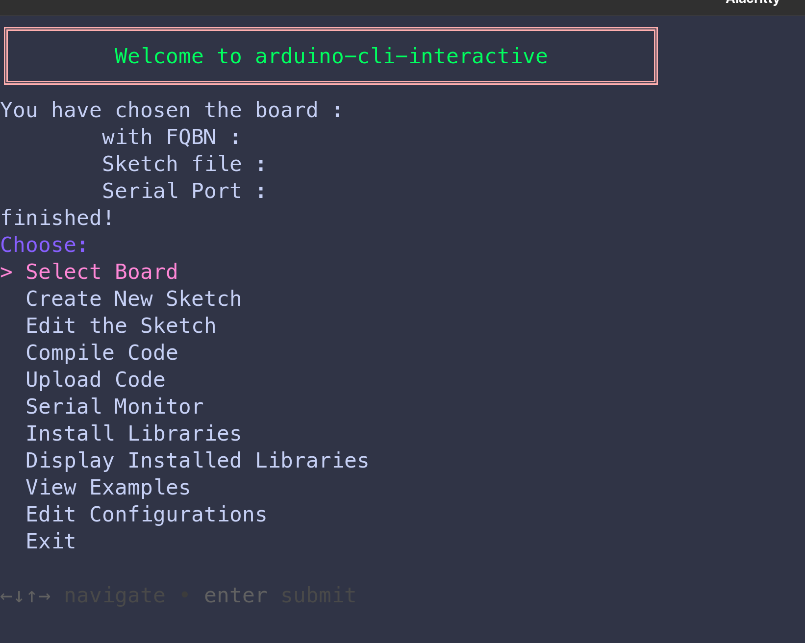
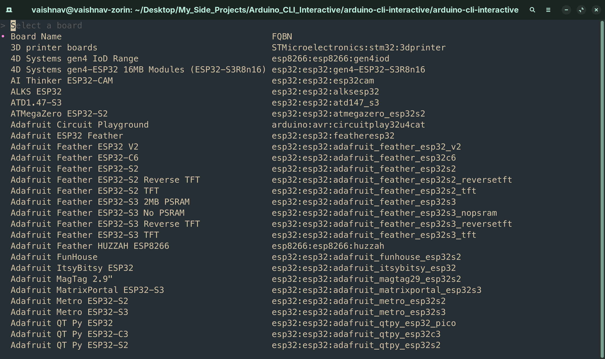
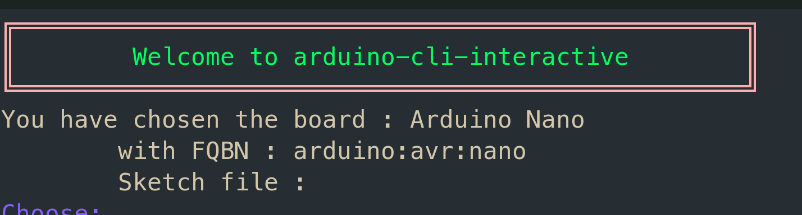

# Chapter 2 (How to use `aci` PART - 1)

By the end of this chapter , you will be able to do the following :

1. [Select a Board to use](#select-a-board)
2. [Create a New sketch using `aci`](#create-a-new-sketch)
3. [Edit the created sketch](#edit-a-sketch)
<br><br>
## Select a Board 

Open your terminal and type `aci`. 
You will be greeted with this page 



<br><br>

Press `Enter` to enter the Board Selection Menu : 



<br><br>

Type the Board Name you want to use and press `Enter`. 

Then a confirmation dialog box will open asking you to confirm the board you chose. 

Check the following GIF to see it in action. 

For example , let's use an Arduino Nano that is connected to my system , 


<br><br>

Once you have selected a board, you can see the Board name and FQBN (Full Qualified Board Name) just
below the "Welcome to arduino-cli-interactive" sign like so 



<br><br>
## Create a New Sketch 

A sketch is a file with the `.ino` extension in which you will write the code to upload
to the board. 

To create a new sketch , first navigate to the directory you want the sketch to be in , in the terminal , run the `aci` command , select a board and then use the 
Down arrow key to move down to the next option which **Create a New Sketch** and press **Enter**. 

This will then bring up an Input box where you can enter the name of your sketch. 


Congrats , you have created a new sketch using the command line. 

<br><br>
## Edit a Sketch 

After creating a new sketch , let us add the code to be uploaded to the board. 

We will create a basic LED Blinking program to blink the inbuilt LED of the board every 1 second. 

Before we get into editing the sketch , copy the below program :

```c 
const int ledPin = 13;    //Depends on the board , for Uno and Nano it is pin 13

void setup() {
  //This function will run only once when the board boots up 
  pinMode(ledPin , OUTPUT);  //Setting the ledPin as OUTPUT
}

void loop() {
  //This function runs infinitely until it is stopped
  digitalWrite(ledPin , HIGH);   //Turn ON the LED
  delay(1000);     //1 second delay
  digitalWrite(ledPin , LOW) ;  //Turn OFF the LED 
  delay(1000);     //1 second delay
}
```

Now , let us go to the terminal where `aci` is already running and then open the sketch `MyFirstSketch` , 
we created previously. 

Make sure you have selected your [board](#select-a-board) and the [sketch](#create-a-new-sketch) 
has been created.

Now navigate to the **Edit the Sketch** option using the Down arrow key and press **Enter**. 

This will bring up a file picker throuh which you can navigate using the arrow keys to find the folder
in which the sketch is present. 

Once you find the folder , press **Enter** , you can then see the `.ino` file in the file picker. 

Press **Enter** again and you will see a choice picker to pick your preferred editor. I will be using
**NeoVim** as my main editor. You can choose whatever editor feels comfortable to you. 

#### **__NOTE__** :
Make sure you have any one of the following editors installed : 

1. [NeoVim](./chapter_1.md#neovim)
2. [Vim](./chapter_1.md#vim)
3. Vi
4. Nano  
5. [Micro](./chapter_1.md#micro)
6. [Visual Studio Code](./chapter_1.md#vscode)
7. [VSCodium](./chapter_1.md#vscodium)
8. [Helix](./chapter_1.md#hx)

Select the editor of your choice. 

You will now be able to edit the file. 
If you are opening the file for the first time , you will be greeted with this code 

```c
void setup(){
  //Run only once when the board boots up
}

void loop(){
  //Run infinitely until stopped
}
```

This is the default boilerplate code of any Arduino file. 

There are 2 functions `setup()` and `loop()`. 

`setup()` runs only once. It runs when the board is switched ON.
`loop()` run infnitely until it is stopped by switching OFF the board or by an interrupt. 

In the [example code](#edit-a-sketch) that was given , we can see that we have defined the constant
`ledPin` as an Output in the `setup()` function and toggled the LED in the `loop()` function.

You can paste the [example code](#edit-a-sketch) by deleting the default contents of the file and then 
pasting the given code. 

Then you can save the code and exit the editor.

You will then be asked if you want to preview the contentns of your file to check for any kind of mistakes. 

Choose **YES** or **NO** by navigating between them using arrow keys. 

To quit the preview , press `q` on your keyboard. 


<br><br>
#### **__NOTE__** :

Each editor has different shortcuts to save and exit a file 

1. Vi/Vim/NeoVim/Helix : `:wq`
2. Nano : `Ctrl + S , Ctrl + X`
3. Micro : `Ctrl + S , Ctrl + Q`
4. Visual Studio Code/VSCodium : `Ctrl + S , Alt + F4`


