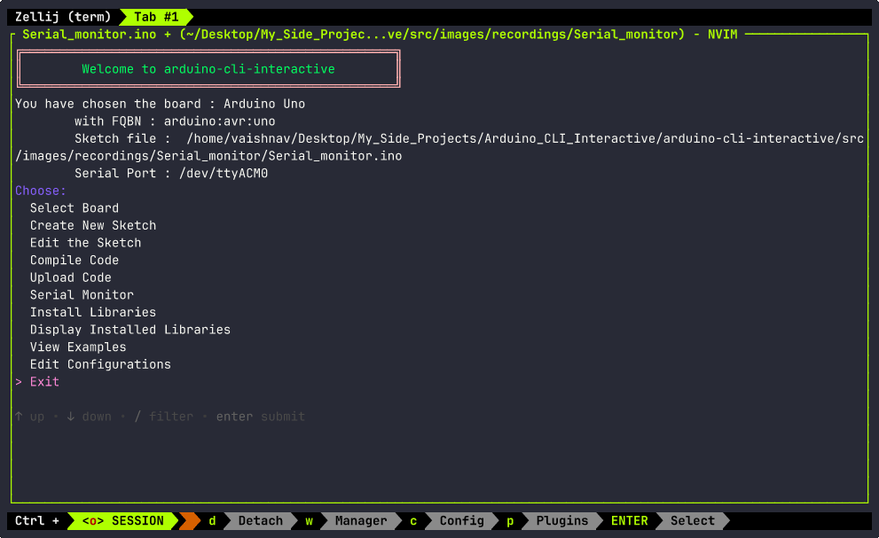

# Chapter 6  (Serial Monitor Output Viewing)

The Serial Monitor Feature was released in V1.0.4

There are 2 main ways to use the Serial Monitor feature in `arduino-cli`: 
1. `arduino-cli monitor` (Default)
2. SSH clients like puTTY

For now , `aci` uses the `monitor` keyword to open a Serial communication between the board and the computer. 

## The Serial Monitor

The Serial Monitor in Arduino uses Serial communication (UART protocol) to establish a communication between the board
and the programming computer or any other device like sensors. 

To use the Serial Monitor feature in `aci`, make sure you have done the following :
1. [Selecting a Board](./chapter_2.md#select-a-board)
2. [Creating a New Sketch](./chapter_2.md#create-a-new-sketch)
3. [Editing the Sketch](./chapter_2.md#edit-a-sketch)
4. [Compiled the Sketch](./chapter_3.md#compile-code)
5. [Uploaded the Code](./chapter_3.md#upload-code)

The sketch used for the **Hello World** program is given below :

```c
void setup(){
  Serial.begin(9600);
}

void loop() {
  Serial.println(9600);
  delay(1000);
}
```

Once these are done, in the homepage , navigate to the **Serial Monitor** Option using the arrow keys and
press **Enter**. 

Now a selection menu appears that prompts you to select the Baud Rate you used in your program (9600, 
115200 etc.). Select the correct baud rate you used and press **Enter**. 

The Serial Monitor is now open for business. To exit the serial monitor, press *CTRL + C* 2 times. 
The second time, you will be prompted for confimation to return to the homepage. Choose what you want
and press **Enter**. 

Check out the below recording to see the Serial Monitor in action. 


