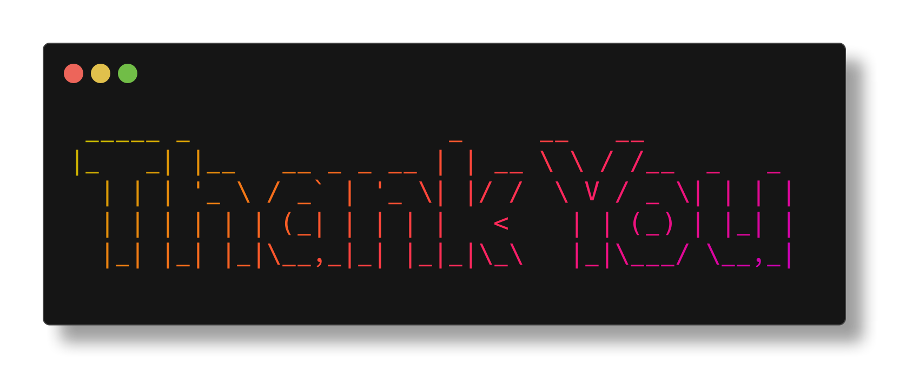

# Thank you

I want to take a moment to express my heartfelt gratitude to you for choosing arduino-cli-interactive. 
Your support and feedback have been invaluable in shaping this tool into what it is today. 
Whether you’re a hobbyist, a student, or a professional, your trust motivates me to keep improving 
and delivering a better experience for everyone in the Arduino community.

Your enthusiasm for this project means the world to me! If you’ve enjoyed using arduino-cli-interactive,
I kindly request you to star ⭐ the repository on [GitHub](https://github.com/Vaishnav-Sabari-Girish/arduino-cli-interactive)
to help it reach more users. You can also fork 🍴 
it to make your own contributions or explore its capabilities further.

I also invite you to stay connected with me as I continue this exciting journey. 
Be sure to follow me on [Medium](https://medium.com/@forgamesonly684) , 
[Dev.to](https://dev.to/vaishnav_sabari_girish) and [GitHub](https://github.com/Vaishnav-Sabari-Girish) 
for insightful blogs, updates, and tutorials related to Arduino, CLI tools, and embedded systems. 
There’s so much more coming your way, including new features for this tool and engaging content on 
these platforms.

Your support keeps this project alive, and your feedback helps me grow. If you have any suggestions, 
feature requests, or just want to share how this tool has helped you, don’t hesitate to reach out. 
Together, we can make arduino-cli-interactive an even more powerful tool for the Arduino community.

Thank you once again for your trust and support. Let’s build something amazing, one project at a time!
  

